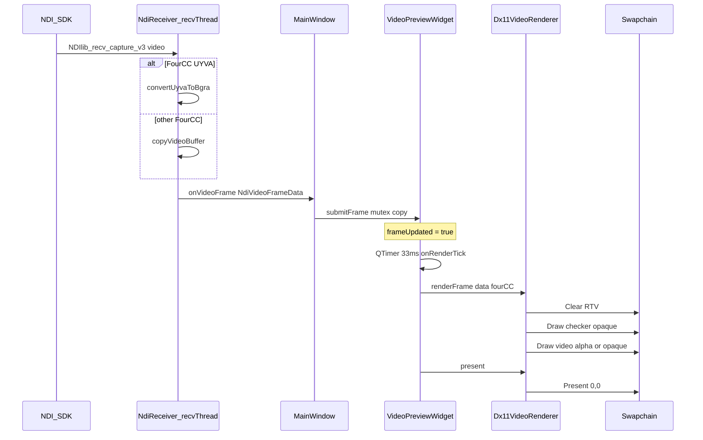
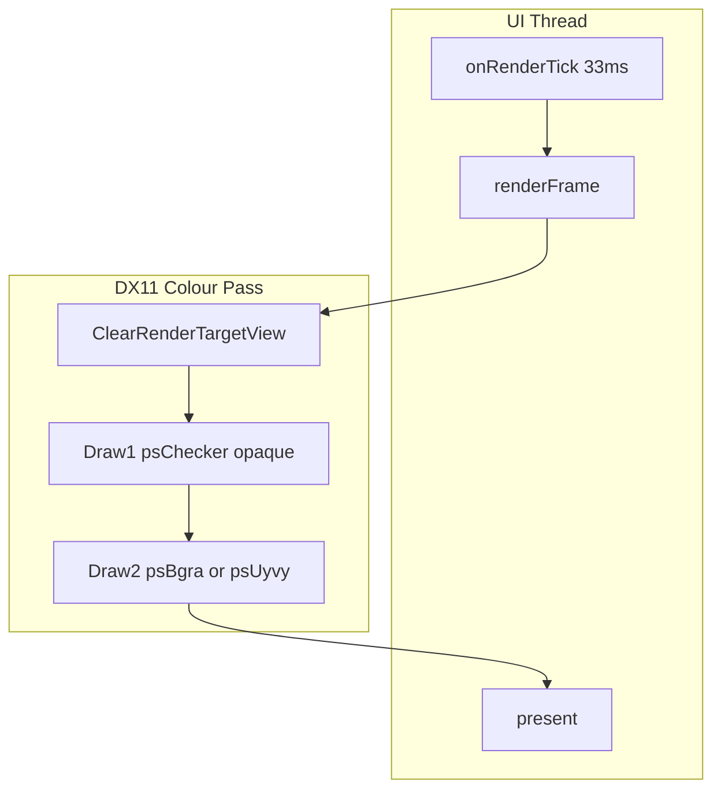

# NDIReceiver 预览渲染与 Alpha 混合

本文档说明 NDIReceiver 如何将收到的 NDI 视频帧与**透明检测背景（棋盘格）**在 DX11 中叠加混合，含端到端数据流、核心 API、关键代码与 RenderDoc 抓帧对照。

相关文档：

- 推拉流像素格式与 Alpha 测试总览：[04-开发计划与架构设计 §5.2](04-开发计划与架构设计.md#52-alpha-透明度测试架构)
- 联调步骤：[05-联调验证指南 §测试 6](05-联调验证指南.md#测试-6alpha-透明度推拉流)

---

## 1. 概述

### 1.1 功能目标

- 在预览窗口绘制 **16×16 像素棋盘格** 作为透明区域指示背景。
- 将 NDI 视频帧以全屏 Quad 叠加上去；当帧带 **BGRA Alpha** 时，透明/半透明区域透出棋盘格。
- **预览 Alpha 倍增** 滑动条可在 CPU 侧缩放 BGRA 的 Alpha，用于验证混合管线（不改变 NDI 原始数据）。

### 1.2 涉及模块

| 模块 | 路径 | 职责 |
|------|------|------|
| UI 控制 | `apps/NDIReceiver/MainWindow.cpp` | 棋盘格开关、预览 Alpha 滑动条、帧回调 |
| NDI 接收 | `common/ndi/NdiReceiver.cpp` | 拉流、UYVA→BGRA 转换、回调 `NdiVideoFrameData` |
| 预览控件 | `common/render/VideoPreviewWidget.cpp` | 线程安全帧缓冲、UI 定时刷新 |
| DX11 渲染 | `common/render/Dx11VideoRenderer.cpp` | 棋盘格 + 视频两次 Draw、Alpha 混合 |

### 1.3 设计要点

- **单 Swapchain 目标**：棋盘格与视频均绘制到同一 `RenderTargetView`（Swapchain 后备缓冲）。
- **两次 Draw(4)**：先 opaque 画棋盘格，再按条件 alpha-blend 画视频（见 §4）。
- **接收线程写帧、UI 线程渲染**：避免每帧 `invokeMethod` 阻塞 Qt 主线程（见 [04 §5.3](04-开发计划与架构设计.md#53-ui-线程与预览性能)）。

---

## 2. 端到端数据流





---

## 3. UI 控制链

| UI 控件 | MainWindow 槽 | VideoPreviewWidget | Dx11VideoRenderer |
|---------|---------------|--------------------|-------------------|
| **启用透明检测背景（棋盘格）** | `onAlphaCheckerToggled` | `setAlphaCheckerBackground` | `alphaCheckerBackground_` |
| **预览 Alpha 倍增** 滑动条 | `onPreviewAlphaChanged` | `setPreviewAlphaScale` | `previewAlphaScale_` |
| **Alpha 测试预设** | `onAlphaTestPreset` | 启用棋盘格 + Alpha=100% | 同上 |

开始接收时同步一次当前 UI 状态：

```374:375:apps/NDIReceiver/MainWindow.cpp
    preview_->setAlphaCheckerBackground(alphaCheckerCheck_->isChecked());
    preview_->setPreviewAlphaScale(static_cast<float>(previewAlphaSlider_->value()) / 100.f);
```

帧到达路径：

```395:411:apps/NDIReceiver/MainWindow.cpp
void MainWindow::onVideoFrame(const NdiVideoFrameData& frame) {
    if (frame.buffer.empty()) {
        return;
    }
    // ... Alpha 统计采样 ...
    preview_->submitFrame(frame.buffer.data(), frame.width, frame.height,
                          frame.stride, frame.fourCC);
}
```

---

## 4. DX11 单帧渲染管线

入口：`Dx11VideoRenderer::renderFrame`（无帧且仅开棋盘格时走 `renderCheckerboardOnly`）。

### 4.1 步骤概览

| 步骤 | API / 函数 | 说明 |
|------|------------|------|
| 1 | `uploadBgra` / `uploadUyvy` | 将 CPU 帧写入动态纹理 `texture_` + `srv_` |
| 2 | `ClearRenderTargetView` | 清屏色 `{0.1, 0.1, 0.12, 1}` |
| 3 | `drawCheckerBackground` | **Pass 1**：`psChecker_`，**opaque** 混合 |
| 4 | `OMSetBlendState` | 按 `useAlphaBlend` 选择 alpha 或 opaque |
| 5 | `Draw(4)` + `psBgra_`/`psUyvy_` | **Pass 2**：采样视频纹理，全屏 Quad |
| 6 | `present` | `SwapChain->Present(0, 0)` |

### 4.2 Alpha 混合判定

```365:366:common/render/Dx11VideoRenderer.cpp
    const bool useAlphaBlend = alphaCheckerBackground_
        && (hasAlphaChannel(fourCC) || previewAlphaScale_ < 0.999f);
```

| 棋盘格 | FourCC | 预览 Alpha | useAlphaBlend | 视觉效果 |
|--------|--------|------------|---------------|----------|
| 关 | 任意 | 任意 | false | 仅视频，不透明 |
| 开 | **BGRA** | 100% | **true** | 标准 Alpha 混合 |
| 开 | BGRX / UYVY | 100% | false | 视频 Pass 不透明，**盖住棋盘格** |
| 开 | **BGRA** | &lt;100% | **true** | CPU 缩放 Alpha 后混合 |
| 开 | BGRX / UYVY | &lt;100% | true | 启用 blend，但 UYVY PS 输出 alpha=1，**仍几乎不透明** |

`hasAlphaChannel` 仅对 **BGRA** 为 true（**BGRX 不算**）。

### 4.3 混合状态（Blend State）

创建于 `createShaders`：

```189:202:common/render/Dx11VideoRenderer.cpp
    D3D11_BLEND_DESC blendDesc{};
    blendDesc.RenderTarget[0].BlendEnable = TRUE;
    blendDesc.RenderTarget[0].SrcBlend = D3D11_BLEND_SRC_ALPHA;
    blendDesc.RenderTarget[0].DestBlend = D3D11_BLEND_INV_SRC_ALPHA;
    blendDesc.RenderTarget[0].BlendOp = D3D11_BLEND_OP_ADD;
    blendDesc.RenderTarget[0].SrcBlendAlpha = D3D11_BLEND_ONE;
    blendDesc.RenderTarget[0].DestBlendAlpha = D3D11_BLEND_ZERO;
    blendDesc.RenderTarget[0].BlendOpAlpha = D3D11_BLEND_OP_ADD;
    // ... alphaBlendState_
    // opaqueBlendState_: BlendEnable = FALSE
```

**RGB 混合公式**（标准 over 操作）：

\[
\text{FinalRGB} = \text{SrcRGB} \times \text{SrcA} + \text{DestRGB} \times (1 - \text{SrcA})
\]

- **Pass 1（棋盘格）**：`opaqueBlendState_`，`psChecker` 输出 `float4(rgb, 1.0)`，直接覆盖 RTV。
- **Pass 2（视频）**：`useAlphaBlend` 为 true 时使用 `alphaBlendState_`，源 Alpha 来自 BGRA 纹理的 A 通道（或经 `previewAlphaScale_` 缩放后的值）。

### 4.4 预览 Alpha 倍增（CPU 侧）

仅在 **BGRA 上传** 且 `previewAlphaScale_ < 0.999` 时生效：

```255:268:common/render/Dx11VideoRenderer.cpp
    if (previewAlphaScale_ < 0.999f && data) {
        // ... 每像素: dstA = srcA * previewAlphaScale_
        uploadData = scaledBgraBuffer_.data();
    }
```

**不改变** `MainWindow` 中用于统计的原始 `NdiVideoFrameData`，仅影响 GPU 纹理。

---

## 5. Shader 说明

共用顶点着色器 `kVertexShader`：NDC 全屏 Quad（`TRIANGLESTRIP`，4 顶点），传递 UV。

| 成员 | 像素着色器 | 输入 | 输出 | 用途 |
|------|------------|------|------|------|
| `psChecker_` | `kPixelShaderChecker` | 像素坐标 `pos` | 16px 棋盘格，浅灰/深灰，**alpha=1** | 透明检测背景 |
| `psBgra_` | `kPixelShaderBgra` | `Texture2D` + 采样器 | `tex.Sample` 直通 BGRA | BGRA/BGRX 视频 |
| `psUyvy_` | `kPixelShaderUyvy` | 打包 UYVY 纹理 | YUV→RGB，**alpha=1** | Fastest 常见 UYVY 路径 |

棋盘格逻辑（片段按屏幕像素坐标取模 16px）：

```56:63:common/render/Dx11VideoRenderer.cpp
    const float tile = 16.0;
    int cx = int(pos.x / tile);
    int cy = int(pos.y / tile);
    bool dark = ((cx + cy) & 1) == 0;
    // light (0.82) / dark (0.45)
```

---

## 6. 核心结构体与接口

### 6.1 `NdiVideoFrameData`

定义于 [`common/ndi/NdiReceiver.h`](../common/ndi/NdiReceiver.h)：

| 字段 | 类型 | 说明 |
|------|------|------|
| `buffer` | `std::vector<uint8_t>` | 像素数据副本（与 NDI SDK 缓冲生命周期解耦） |
| `width` / `height` | `int` | 分辨率 |
| `stride` | `int` | 行字节步长；0 时由 FourCC 推断 |
| `fourCC` | `NDIlib_FourCC_video_type_e` | 交付格式（UYVY、BGRA、UYVA 转换后为 BGRA 等） |
| `frameRateN` / `frameRateD` | `int` | 帧率 |

**UYVA 路径**：`processVideoFrame` 调用 `convertUyvaToBgra`，输出 **BGRA** 缓冲供渲染与 PNG 导出。

### 6.2 `VideoPreviewWidget`

| 方法 | 线程 | 说明 |
|------|------|------|
| `submitFrame(...)` | **接收线程** | mutex 拷贝到 `displayFrame_`，置 `frameUpdated_` |
| `setAlphaCheckerBackground(bool)` | UI | 同步到 renderer，标记 `renderDirty_` |
| `setPreviewAlphaScale(float)` | UI | clamp 0~1，同步到 renderer |
| `onRenderTick()` | **UI**（QTimer 33ms） | 有更新时调用 `renderFrame` + `present` |
| `ensureRenderer()` | UI | 首次需要时创建 `Dx11VideoRenderer` 并绑定 `winId()` |

**线程安全**：`submitFrame` 与 `onRenderTick` 通过 `frameMutex_` 保护 `displayFrame_`；**禁止**在接收线程调用 QTimer 等 Qt UI API。

### 6.3 `Dx11VideoRenderer`

| 方法 | 说明 |
|------|------|
| `initialize(hwnd, w, h)` | 创建 Device、Swapchain（`B8G8R8A8_UNORM`）、RTV、Shader |
| `resize(w, h)` | `ResizeBuffers` 重建 RTV |
| `setAlphaCheckerBackground` / `setPreviewAlphaScale` | 渲染参数 |
| `renderFrame(data, w, h, stride, fourCC)` | 上传纹理 + 两次 Draw |
| `renderCheckerboardOnly()` | 无视频帧时仅画棋盘格 |
| `present()` | `Present(0, 0)` |

**主要 D3D 资源**：

| 成员 | 用途 |
|------|------|
| `swapChain_` / `rtv_` | 窗口后备缓冲 |
| `texture_` / `srv_` | 每帧视频动态纹理 |
| `alphaBlendState_` / `opaqueBlendState_` | Alpha / 不透明混合 |
| `vb_` + `vs_` | 全屏 Quad |
| `psChecker_` / `psBgra_` / `psUyvy_` | 三套像素着色器 |

---

## 7. 关键代码：`renderFrame` 主路径

```352:399:common/render/Dx11VideoRenderer.cpp
void Dx11VideoRenderer::renderFrame(const uint8_t* data, int width, int height, int stride,
                                    NDIlib_FourCC_video_type_e fourCC) {
    // uploadBgra / uploadUyvy → texture_
    const bool useAlphaBlend = alphaCheckerBackground_
        && (hasAlphaChannel(fourCC) || previewAlphaScale_ < 0.999f);

    context_->ClearRenderTargetView(rtv_.Get(), clearColor);
    context_->OMSetRenderTargets(1, rtv_.GetAddressOf(), nullptr);

    if (alphaCheckerBackground_) {
        drawCheckerBackground();  // opaque
    }

    context_->OMSetBlendState(useAlphaBlend ? alphaBlendState_ : opaqueBlendState_, ...);
    // ... Draw(4) with psBgra_ or psUyvy_, sample srv_
}
```

`onRenderTick` 调度逻辑：

```129:173:common/render/VideoPreviewWidget.cpp
void VideoPreviewWidget::onRenderTick() {
    const bool needRender = frameUpdated_.exchange(false) || renderDirty_.exchange(false);
    if (!needRender) return;
    // ... 拷贝 displayFrame_ ...
    renderer_->renderFrame(local.data(), w, h, stride, fourCC);
    renderer_->present();
}
```

---

## 8. RenderDoc 调试指南

### 8.1 抓取 NDIReceiver

1. 启动 **RenderDoc**，确认已注入或 **Launch Application** 指向 `NDIReceiver.exe`。
2. NDIReceiver：**Alpha 测试预设** → 开始接收带 Alpha 的源（如 NDISender Alpha 测试图）。
3. 触发 **Capture Frame**（默认 F12 或 RenderDoc UI）。

### 8.2 预期事件序列（Colour Pass #1）

与用户抓帧 **Frame #187** 对照：

| 顺序 | RenderDoc 事件 | 源码对应 |
|------|----------------|----------|
| 1 | `ClearRenderTargetView` | `clearColor[] = {0.1f, 0.1f, 0.12f, 1.f}` |
| 2 | 第一次 `Draw(4)` | `drawCheckerBackground()` → `psChecker_`，**opaque** blend |
| 3 | `OMSetBlendState`（SrcAlpha / InvSrcAlpha） | `alphaBlendState_`（运行时可能显示为 Blend State 53 等 ID） |
| 4 | 第二次 `Draw(4)` | `psBgra_` 或 `psUyvy_` + `PSSetShaderResources(Texture2D)` |
| 5 | `Present(Swapchain Image N)` | `present()`；格式 **B8G8R8A8_UNORM** |

> RenderDoc 中的 **Pixel Shader 46/47**、**Blend State 53** 等为运行时对象 ID，与源码中 `psChecker_`/`psBgra_` 名称一一对应需通过 **Pipeline State → Shader** 反汇编或绑定纹理区分：棋盘格 Draw **无** SRV 绑定；视频 Draw **有** `Texture2D` 采样。

### 8.3 如何确认 Alpha 混合生效

1. **Texture Viewer / 输出**：透明区域应透出棋盘格；半透明区域为棋盘格与视频色混合。
2. **Pipeline State → OM → Blend State**：第二次 Draw 应为 `SrcBlend=SRC_ALPHA`，`DestBlend=INV_SRC_ALPHA`。
3. **若第二次 Draw 为 opaque**：检查 FourCC 是否为 BGRA、预览 Alpha 是否为 100%；BGRX/UYVY 在 100% 时不走 alpha blend。
4. **通道视图**：对 Swapchain 输出查看 **Alpha** 通道；纯透明区 Alpha 应接近 0（经混合后 RT 仍可能为不透明 swapchain，以 RGB 棋盘格可见为准）。

---

## 9. 常见问题

| 现象 | 原因 | 建议 |
|------|------|------|
| 开启棋盘格但看不到 | FourCC 为 UYVY/BGRX，预览 Alpha=100%，视频 Pass 不透明 | 使用 Alpha 测试图 + Fastest（UYVA→BGRA）；或调低预览 Alpha |
| 预览 Alpha 有效但统计 Alpha 不变 | 预览 Alpha 仅改 GPU 上传路径 | 正常；看 NDI 统计需看原始 BGRA 帧 |
| RenderDoc 只有一次 Draw | 未开棋盘格，或 `renderCheckerboardOnly` 无视频 | 确认 UI 勾选棋盘格且有视频帧 |
| PNG 保存失败 | 仅 **BGRA** 显示帧可导出 | 确认 UYVA 已转换或 color_format 交付 BGRA |

---

## 10. 参考文件索引

| 文件 | 内容 |
|------|------|
| [`common/render/Dx11VideoRenderer.cpp`](../common/render/Dx11VideoRenderer.cpp) | Shader、Blend、renderFrame |
| [`common/render/Dx11VideoRenderer.h`](../common/render/Dx11VideoRenderer.h) | 渲染器 public/private API |
| [`common/render/VideoPreviewWidget.cpp`](../common/render/VideoPreviewWidget.cpp) | 帧缓冲、定时渲染 |
| [`common/ndi/NdiReceiver.cpp`](../common/ndi/NdiReceiver.cpp) | UYVA→BGRA、`NdiVideoFrameData` |
| [`apps/NDIReceiver/MainWindow.cpp`](../apps/NDIReceiver/MainWindow.cpp) | UI 与 `onVideoFrame` |
