# 软件整体架构与 UML 设计

本文档描述 NDI-Study Demo 的**整体架构**、**运行流程**、**时序交互**与**各模块 UML 类图**。参数映射与像素格式细节见 [04-开发计划与架构设计](04-开发计划与架构设计.md)；Alpha 渲染细节见 [07-NDIReceiver预览渲染与Alpha混合](07-NDIReceiver预览渲染与Alpha混合.md)。

---

## 1. 系统上下文

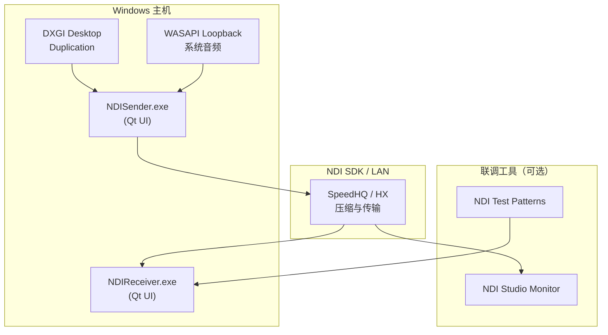

| 组件 | 技术栈 | 职责 |
|------|--------|------|
| **NDISender** | Qt 5.15、DXGI、WASAPI、MF H.264 | 采集桌面/测试图与系统音频，经 NDI SDK 推流 |
| **NDIReceiver** | Qt 5.15、DX11、SDL2 | 发现/连接 NDI 源，DX11 预览与 SDL2 播放 |
| **ndi_study_common** | C++17 静态库 | NDI 封装、采集、编码、渲染、音频、格式转换 |

---

## 2. 分层架构

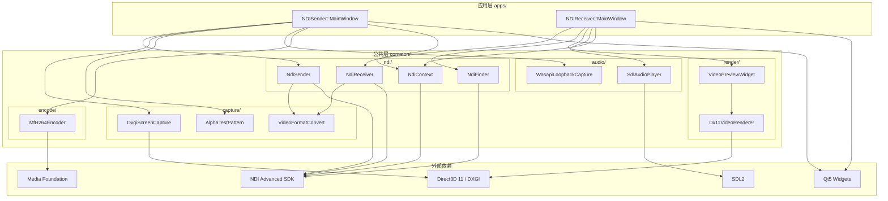

---

## 3. 线程模型

| 线程 | 所属 | 职责 |
|------|------|------|
| **Qt UI 主线程** | Sender / Receiver | 控件、定时器、状态栏/统计刷新 |
| **captureThread_** | Sender | `runCaptureLoop`：DXGI 或测试图 → 编码/发送 |
| **WASAPI 采集线程** | Sender | Loopback 采集 → `NdiSender::sendAudio` |
| **recvThread_** | Receiver | `NdiReceiver::recvLoop`：`recv_capture_v3` / Frame Sync |
| **sourceRefreshThread_** | Receiver | 后台 `NdiFinder::refresh`，避免 UI 阻塞 |
| **SDL 音频回调** | Receiver | `SdlAudioPlayer` 从队列取 float 样本播放 |

**跨线程原则**

- Sender：视频双缓冲 ping-pong（`NdiSender::videoSendBuffers_`）；音频在独立采集线程发送
- Receiver：接收线程写 `VideoPreviewWidget::displayFrame_`（mutex）；UI 定时器 ~33ms 触发 DX11 渲染，**不**每帧 `invokeMethod` 投递整帧

---

## 4. 运行流程图

### 4.1 NDISender 推流总览

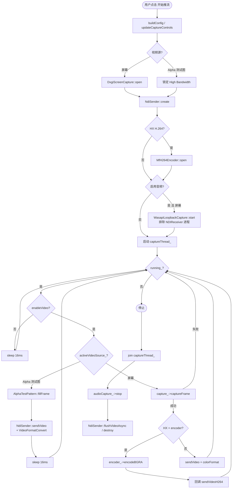

### 4.2 NDIReceiver 接收总览

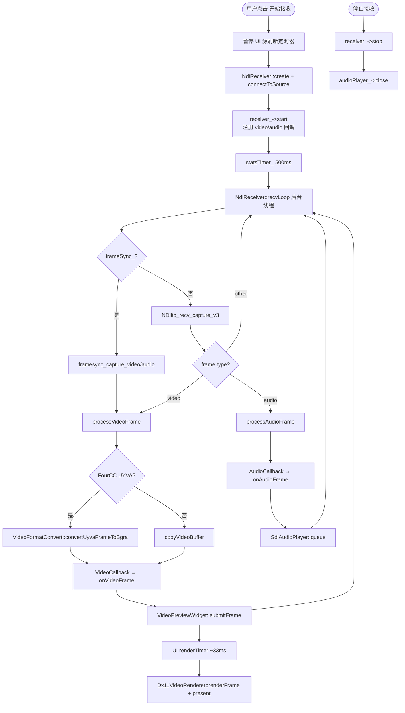

### 4.3 视频帧数据路径（High Bandwidth）

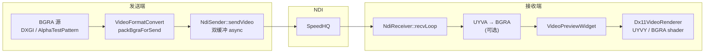

---

## 5. 时序图

### 5.1 NDISender：High Bandwidth 屏幕采集推流

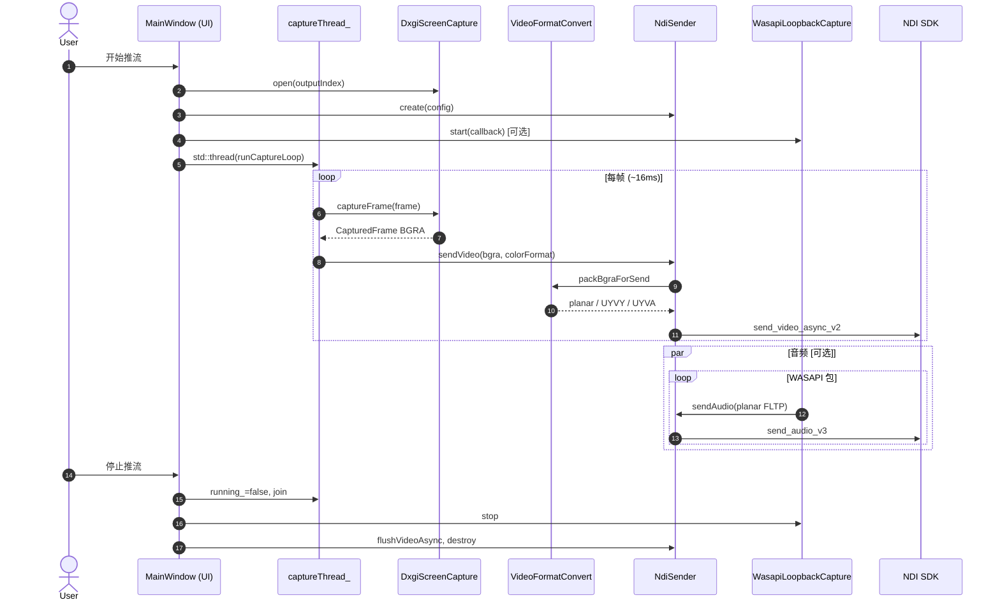

### 5.2 NDISender：HX H.264 推流

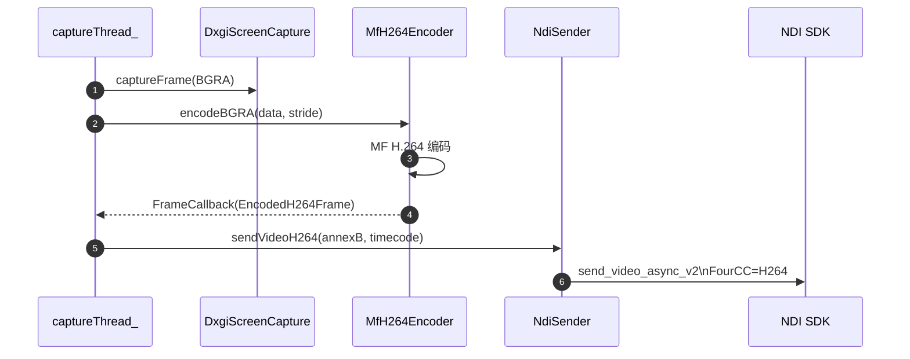

### 5.3 NDIReceiver：拉流与预览

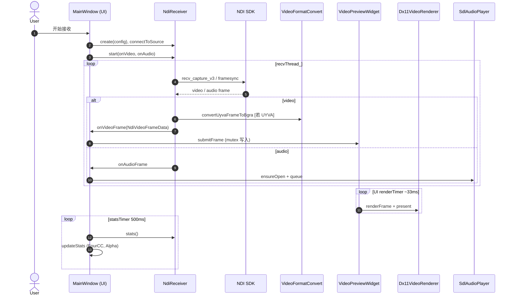

### 5.4 Alpha 透明度联调（推荐路径）

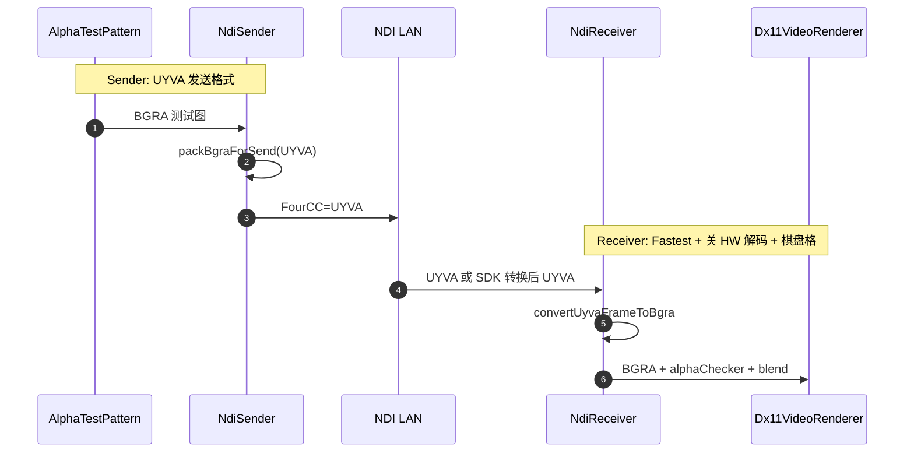

---

## 6. 模块 UML 类图

### 6.1 ndi 模块

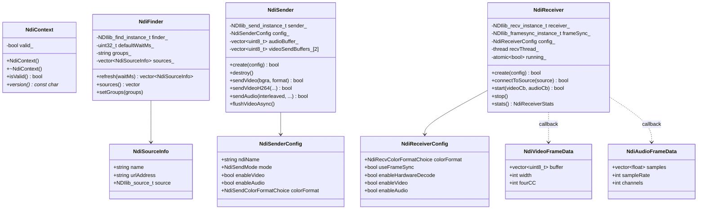

### 6.2 capture 模块

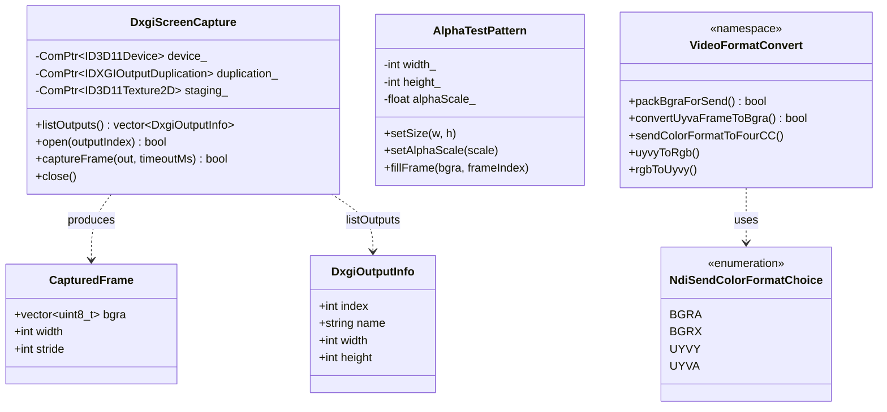

### 6.3 encode 模块

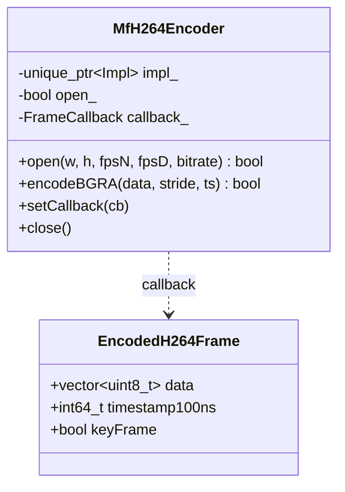

### 6.4 render 模块

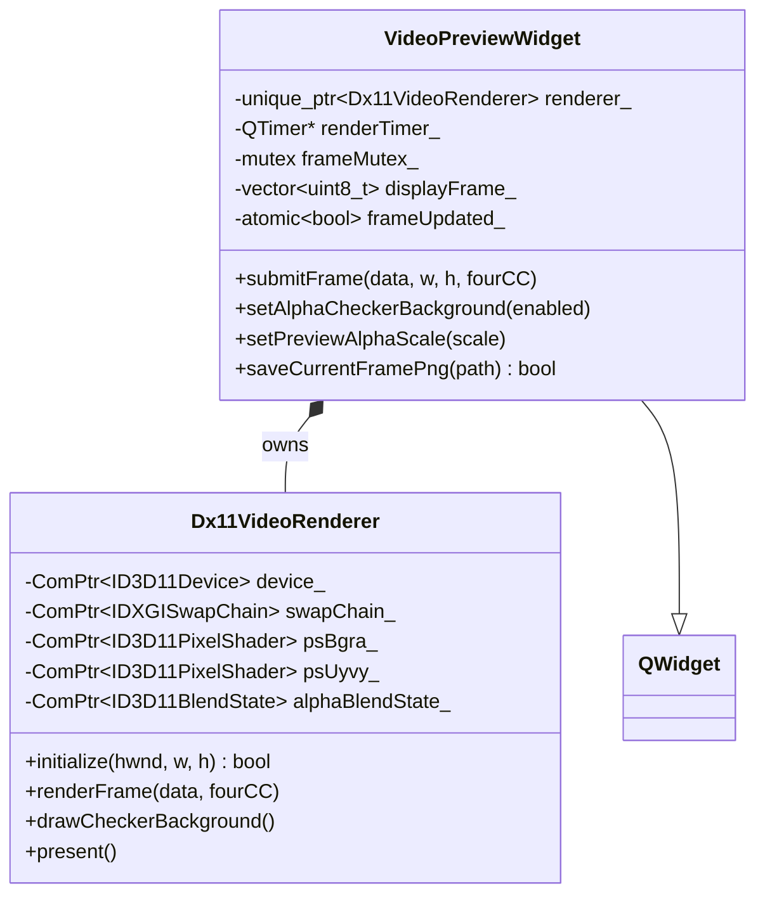

### 6.5 audio 模块

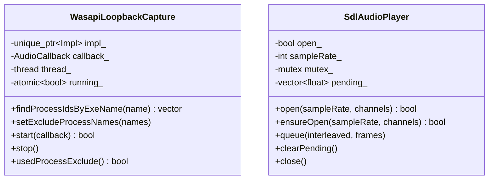

### 6.6 应用层 MainWindow

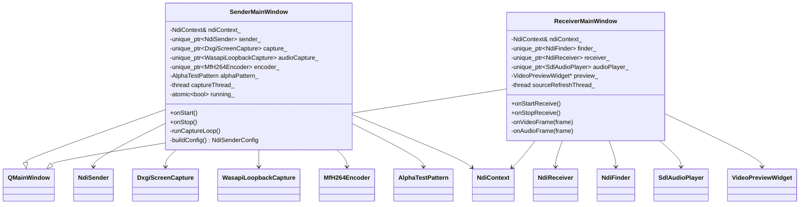

---

## 7. CMake 与依赖关系

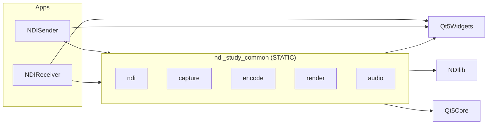

| 目标 | 链接库 | POST_BUILD 部署 |
|------|--------|-----------------|
| `NDISender` | `ndi_study_common`, Qt | NDI DLL、SDL2 DLL |
| `NDIReceiver` | `ndi_study_common`, Qt | NDI DLL、SDL2 DLL |
| `ndi_study_common` | NDI, Qt, d3d11, dxgi, mfplat, mmdevapi, SDL2(可选) | — |

---

## 8. 文档与代码对照

| 主题 | 文档 |
|------|------|
| 参数映射 / FourCC | [04-开发计划与架构设计](04-开发计划与架构设计.md) |
| Alpha 渲染 / DX11 混合 | [07-NDIReceiver预览渲染与Alpha混合](07-NDIReceiver预览渲染与Alpha混合.md) |
| 联调步骤 | [05-联调验证指南](05-联调验证指南.md) |
| 功能清单 | [06-功能清单与变更记录](06-功能清单与变更记录.md) |
| SDK 放置 / 打包脚本 | [third_party/README.md](../third_party/README.md) |

---

## 9. 修订记录

| 日期 | 说明 |
|------|------|
| 2026-05-30 | 初版：整体架构、运行流程、时序图、分模块 UML 类图 |
