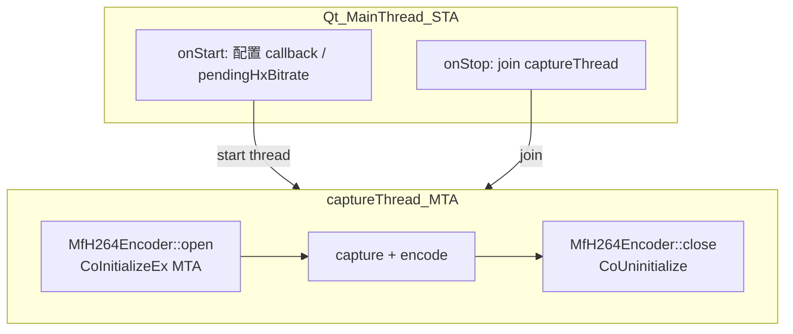

# COM 套间与 HX H.264 编码线程问题

本文档记录 NDISender 在 **HX H.264** 模式下 `CoInitializeEx` 返回 `0x80010106 (RPC_E_CHANGED_MODE)` 的根因、排查方法与修复方案。GPU 编码管线背景见 [09-NDI发送端GPU与硬件加速调研](09-NDI发送端GPU与硬件加速调研.md)。

---

## 1. 现象

切换发送模式为 **HX H.264 (Media Foundation)** 并点击「开始推流」时，在 `MfH264Encoder::open()` 内调用：

```cpp
CoInitializeEx(nullptr, COINIT_MULTITHREADED);
```

返回：

| 字段 | 值 |
|------|-----|
| HRESULT | `0x80010106` |
| 名称 | `RPC_E_CHANGED_MODE` |
| 含义 | 当前线程已用**不兼容**的套间模型初始化 COM，无法改为 MTA |

调用栈（Debug）：`MainWindow::onStart()` → `MfH264Encoder::open()`（**Qt UI 主线程**）。

---

## 2. 根因

### 2.1 谁初始化了 STA？

| 组件 | 线程 | COM 套间 |
|------|------|----------|
| **Qt `QApplication`** | UI 主线程 | **STA**（`COINIT_APARTMENTTHREADED` / `OleInitialize`） |
| [`WasapiLoopbackCapture`](../../common/audio/WasapiLoopbackCapture.cpp) | 独立音频线程 | **MTA**（线程内自行 `CoInitializeEx(MTA)`） |
| [`MfH264Encoder`](../../common/encode/MfH264Encoder.cpp)（修复前） | **UI 主线程** `open()` | 请求 **MTA** → 与 Qt STA **冲突** |
| `DxgiScreenCapture` / NDI SDK | 无 COM 初始化 | — |

**结论**：并非项目内另一处显式 STA 与 MF 冲突，而是 **Qt 主线程默认 STA**，却在 UI 线程上调用 `CoInitializeEx(COINIT_MULTITHREADED)`。

参考：[Qt Multimedia on Windows](https://doc.qt.io/qt-6/qtmultimedia-windows.html)、[CoInitializeEx](https://learn.microsoft.com/en-us/windows/win32/api/combaseapi/nf-combaseapi-coinitializeex)。

### 2.2 第二个问题：COM 对象跨线程使用

修复前：

- `encoder_->open()` 在 **UI 线程**
- `encodeGpuBgraTexture` / `encodeBGRA` 在 **`captureThread_`**

`IMFTransform`、`IMFDXGIDeviceManager` 在 A 线程创建、B 线程调用，违反 COM 线程亲和性。即使强行在 STA 上 `open` 成功也不安全。

---

## 3. 运行时检测：`GetApartmentType`

```cpp
#include <windows.h>

HRESULT LogApartmentType(const wchar_t* tag) {
    APTTYPE aptType = APTTYPE_CURRENT;
    APTTYPEQUALIFIER aptQualifier = APTTYPEQUALIFIER_NONE;
    const HRESULT hr = CoGetApartmentType(&aptType, &aptQualifier);
    if (FAILED(hr)) {
        OutputDebugStringW(L"[COM] CoGetApartmentType failed\n");
        return hr;
    }
    const wchar_t* name = L"UNKNOWN";
    switch (aptType) {
        case APTTYPE_STA: name = L"STA"; break;
        case APTTYPE_MTA: name = L"MTA"; break;
        case APTTYPE_NA:  name = L"NA (not initialized)"; break;
        case APTTYPE_MAINSTA: name = L"MAINSTA"; break;
    }
    wchar_t buf[128];
    swprintf_s(buf, L"[COM] %s: %s\n", tag, name);
    OutputDebugStringW(buf);
    return hr;
}
```

| 位置 | 修复前 | 修复后 |
|------|--------|--------|
| `onStart`（UI 线程） | `APTTYPE_STA` | `APTTYPE_STA`（不变） |
| `runCaptureLoop` 入口（capture 线程） | `APTTYPE_NA` | `APTTYPE_MTA` |

---

## 4. 方案对比

### 方案 A：工作线程绑定 MF 生命周期（**已采用**）

与 [`WasapiLoopbackCapture::captureLoop`](../../common/audio/WasapiLoopbackCapture.cpp) 一致：在 **`captureThread_`** 内 `open` / 编码 / `close`，COM 以 MTA 初始化。

**优点**：符合 [Media Foundation and COM](https://learn.microsoft.com/en-us/windows/win32/medfound/media-foundation-and-com) 建议；无需封送；与 OBS 等媒体应用常见做法一致。

### 方案 B：UI 线程改用 STA

MF 控制线程可为 STA，但**编码仍在 capture 线程**，MFT 不能跨线程调用。**不适用**。

### 方案 C：`CoMarshalInterThreadInterfaceInStream` 封送

适用于 UI 持有 `IDispatch` 等需跨套间传递的接口。MF + D3D11 整管线封送成本高，媒体项目**不推荐**。

---

## 5. 本项目修复

### 5.1 线程模型



### 5.2 代码变更摘要

| 文件 | 变更 |
|------|------|
| [`MainWindow.cpp`](../../apps/NDISender/MainWindow.cpp) | `onStart` 不再 `encoder_->open`；`runCaptureLoop` 入口 `open`、出口 `close`；`onStop` 不再 `encoder_->close` |
| [`MfH264Encoder.cpp`](../../common/encode/MfH264Encoder.cpp) | `RPC_E_CHANGED_MODE` 明确失败；接受 `S_FALSE`；`close()` 配对 `CoUninitialize` |

### 5.3 验证步骤

1. Debug 下 HX 模式推流：`CoInitializeEx` 不再返回 `0x80010106`。
2. capture 线程 `GetApartmentType` 为 **MTA**。
3. 状态栏显示「GPU / CPU 编码」，NDIReceiver 可收 HX 流。
4. 多次开始/停止无崩溃。

### 5.4 可选后续

将 `capture_->open()` 移入 `captureThread_`，避免 D3D11 `ID3D11DeviceContext` 在 UI 线程创建、capture 线程使用的潜在风险。

---

## 6. `CoInitializeEx` 返回值：接受 `S_OK` / `S_FALSE` 是否安全？

修复后 [`MfH264Encoder::open`](../../common/encode/MfH264Encoder.cpp) 对 `CoInitializeEx` 的处理如下：

```cpp
const HRESULT hr = CoInitializeEx(nullptr, COINIT_MULTITHREADED);
if (hr == RPC_E_CHANGED_MODE) {
    return false;   // 套间模型不兼容（如在 Qt STA 主线程调用）
}
if (FAILED(hr)) {
    return false;   // 其它错误
}
// S_OK 或 S_FALSE 均继续
impl_->comInitialized = true;
```

### 6.1 各返回值的含义

| 返回值 | 含义 | 处理方式 |
|--------|------|----------|
| `S_OK` | 本线程首次以 MTA 成功初始化 COM | 继续 |
| `S_FALSE` | 本线程**已**以**相同**模式（MTA）初始化过 | 继续（`FAILED(S_FALSE)` 为 false） |
| `RPC_E_CHANGED_MODE` | 本线程已是 STA 等不兼容模式，无法改为 MTA | **必须失败** |
| 其它 `FAILED(hr)` | 其它 COM 错误 | 失败 |

微软文档说明：每次成功的 `CoInitializeEx`（**包括返回 `S_FALSE` 的调用**）都需与一次 `CoUninitialize` 配对。当前 `close()` 在 `impl_->comInitialized` 时调用 `CoUninitialize()`，引用计数平衡正确。

**`S_FALSE` 不会掩盖 STA/MTA 冲突**——该情况走 `RPC_E_CHANGED_MODE` 分支，已被单独拦截。

### 6.2 是否会带来多线程问题？

**接受 `S_OK` / `S_FALSE` 本身不会引入额外的多线程问题**；套间是否安全，取决于 **MF 对象是否在 MTA 工作线程上创建并使用**。

| 风险类型 | 与 `S_FALSE` 有关吗 | 说明 |
|----------|---------------------|------|
| 套间模型冲突（STA vs MTA） | 否 | `S_FALSE` 表示模型**已兼容**；原 bug 为 UI 线程 STA 上请求 MTA |
| COM 对象跨线程使用 | 否 | 修复前 `open` 在 UI 线程、`encode` 在 capture 线程才是隐患；现已同线程 |
| `CoUninitialize` 配对 | 仅当同线程有第三方先 init COM 时需留意 | 本项目 capture 线程目前仅 MF 编码器 init COM，配对无问题 |

在本项目当前架构下：

- `captureThread_` 首次 `open()` 前通常为 `APTTYPE_NA`，实际几乎总是得到 **`S_OK`**。
- `S_FALSE` 仅在同一线程、相同 MTA 模型下重复 `CoInitializeEx` 时出现；代码有 `impl_->comInitialized` 守卫，且 `open()` 开头会 `close()`，正常路径很少触发。

### 6.3 方案可行性结论

**可行，且为业界常规做法。**

- 关键修复是 **将 MF 编码器生命周期绑定到 MTA 工作线程**（`captureThread_`），而非在 Qt STA 主线程硬改套间。
- 与 [`WasapiLoopbackCapture`](../../common/audio/WasapiLoopbackCapture.cpp) 的独立线程 MTA 模式一致。
- 比在 UI 线程改用 STA，或对 `IMFTransform` 整管线做 COM 封送更简单、更可靠。

### 6.4 仍须留意的边界（与 `S_FALSE` 无关）

1. **`MfH264Encoder` 非线程安全**：`open` / `encode` / `close` 不得与 capture 线程并发；UI 线程读取 `isOpen()` / `usesGpuPath()` 在严格意义上存在数据竞争（实践中 bool 读通常可接受）。
2. **D3D11 跨线程**：`capture_->open()` 仍在 UI 线程，而 `CopyResource` 在 capture 线程——见 §5.4 可选后续。
3. **编码 callback 中调用 `NdiSender::sendVideoH264`**：在 capture 线程执行，与 COM 套间无直接关系。

### 6.5 可选防御（Debug）

在 `MfH264Encoder::open()` 成功后调用 §3 的 `LogApartmentType(L"encoder open")`，断言为 `APTTYPE_MTA`，便于确认未在错误线程上 init。

---

## 7. 参考

- [CoInitializeEx](https://learn.microsoft.com/en-us/windows/win32/api/combaseapi/nf-combaseapi-coinitializeex)
- [Media Foundation and COM](https://learn.microsoft.com/en-us/windows/win32/medfound/media-foundation-and-com)
- 本项目 [`WasapiLoopbackCapture.cpp`](../../common/audio/WasapiLoopbackCapture.cpp)（工作线程 MTA 范例）
- NDI SDK [`NDIlib_Recv_GPUDecode.cpp`](../../third_party/NDI%206%20Advanced%20SDK/Examples/C++/NDIlib_Recv_GPUDecode/NDIlib_Recv_GPUDecode.cpp)
