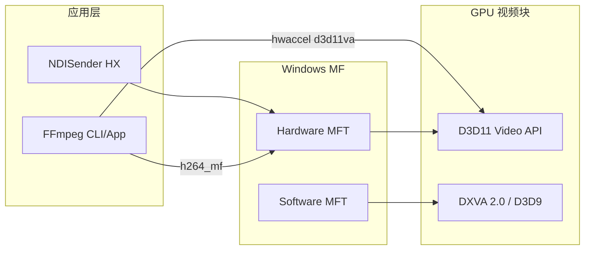

# Media Foundation 框架介绍与使用

本文档整理 Windows **Media Foundation（MF）** 的定位、硬件加速机制、驱动与检测方法，以及与 **FFmpeg**、**DXVA2** 的关系；并结合本仓库 NDI-Study 的 HX 编码与 NDI GPU 解码实践给出选型分析。GPU 发送管线背景见 [09-NDI发送端GPU与硬件加速调研](09-NDI发送端GPU与硬件加速调研.md)；COM 套间问题见 [10-COM套间与HX编码线程问题](10-COM套间与HX编码线程问题.md)。

---

## 0. 结论摘要

| # | 问题 | 结论 |
|---|------|------|
| 1 | Windows MF Media 库是否是目前主流的 SDK？ | **在 Windows 原生多媒体开发中是主流官方 API**（Vista/7 起，Win8+ 以 D3D11 为主）；**在全球跨平台音视频工程领域**，FFmpeg/libav、GStreamer 及各厂商 SDK（NVENC/NVDEC、QSV、AMF）更通用。 |
| 2 | Media Foundation 如何实现硬件加速？ | 通过 **Hardware MFT** + **D3D11-aware** 路径：`MFTEnumEx` 枚举 → `IMFTransform` 激活 → `IMFDXGIDeviceManager` 绑定 GPU → 底层调用 D3D11 Video / DXVA 结构在 GPU 视频块上编解码。 |
| 3 | MF 硬件加速对显卡驱动版本有要求吗？ | **无 Microsoft 公布的统一“最低驱动号”**；取决于 Windows 版本、GPU 的 D3D11 Video / DXVA Profile 能力，以及系统注册表是否启用 Hardware MFT。 |
| 4 | 怎么查看显卡驱动是否支持 MF 硬解？ | 由浅到深：`ffmpeg -encoders` / `MFTEnumEx` + `MF_SA_D3D11_AWARE` / `dxdiag` / MFTrace / 运行本项目或 NDI GPU 解码示例。 |
| 5 | FFmpeg 底层封装的硬件解码是否包含 MF？ | **包含，但是独立封装**：`h264_mf`、`hevc_mf`、`av1_mf` 等 `*_mf` 编解码器直接调用 MF；与 `-hwaccel d3d11va` / `dxva2` **是两条不同路径**。 |
| 6 | MF 硬件加速和 DXVA2 哪个性能更好？ | **不是简单二选一**：MF Hardware MFT（Win8+）走 D3D11；DXVA2 是 D3D9 层 API。现代场景 **D3D11VA 通常优于 DXVA2**；同 GPU 上 MF 硬 MFT 与 FFmpeg `d3d11va` 性能接近，差异主要来自零拷贝管线设计与驱动质量。 |
| — | 音视频开发更推荐 FFmpeg 作基础库？ | **跨平台统一、格式覆盖广、生态成熟**，适合作通用底座；Windows 实时零拷贝管线（如本项目 DXGI→MF）仍需原生 MF / 厂商 SDK 补充。推荐 **FFmpeg 作通用底座 + 平台/场景特化 SDK**。 |

---

## 1. Media Foundation 框架简介

### 1.1 定位

Media Foundation 是 Microsoft 在 Windows Vista 引入、Windows 7 起广泛使用的**官方多媒体管线**，用于替代逐渐式微的 DirectShow。核心组件包括：

| 对象 | 职责 |
|------|------|
| `IMFMediaSource` | 媒体源（文件、摄像头、网络流等） |
| `IMFTransform`（MFT） | 编解码、色彩转换、重采样等变换 |
| `IMFMediaSession` | 拓扑编排与会话控制 |
| `IMFSourceReader` / `IMFSinkWriter` | 简化的读写管线（无需手动建拓扑） |

MF 随 Windows 系统内置，桌面应用链接 `mfplat.lib`、`mfuuid.lib` 即可使用，无需额外授权。

### 1.2 “是否主流”的分层理解

| 场景 | MF 的地位 |
|------|-----------|
| Windows 桌面 / UWP 原生开发 | **主流官方 API**，系统组件、浏览器、播放器广泛依赖 |
| 跨平台音视频产品（Linux/macOS/Windows） | **非主流**，FFmpeg、GStreamer 占主导 |
| 专业实时推流（如 NDI HX） | MF 是 Windows 上**可选实现之一**（另有 NVENC、QSV、AMF 等），HX 编码由应用完成（见 [09-NDI发送端GPU与硬件加速调研](09-NDI发送端GPU与硬件加速调研.md)） |

### 1.3 与本项目的关系

| 模块 | MF 用途 |
|------|---------|
| [`MfH264Encoder`](../../common/encode/MfH264Encoder.cpp) | NDISender **HX H.264** 模式：Hardware Encoder MFT + D3D11 NV12 纹理输入 |
| [`NDIlib_Recv_GPUDecode`](../../third_party/NDI%206%20Advanced%20SDK/Examples/C++/NDIlib_Recv_GPUDecode/NDIlib_Recv_GPUDecode.cpp) | NDI 官方示例：Hardware Decoder MFT + D3D11 输出 NV12 纹理 |



---

## 2. MF 如何实现硬件加速

MF 的硬件加速并非单一 API，而是通过 **MFT（Media Foundation Transform）** 分层实现。关键概念如下。

### 2.1 MFT 类型区分

| 类型 | 枚举标志 / 属性 | 底层实现 |
|------|------------------|----------|
| **Hardware MFT** | `MFT_ENUM_FLAG_HARDWARE` | GPU 代理 MFT 或 AVStream 驱动，处理在硬件中完成 |
| **D3D11-aware MFT** | `MF_SA_D3D11_AWARE == TRUE` | 可通过 `IMFDXGIDeviceManager` 接收/输出 D3D11 纹理 |
| **软件 MFT + DXVA 辅助** | 无 `HARDWARE` 标志，`MF_SA_D3D_AWARE` | CPU 解码为主，可选用 DXVA 2.0（D3D9）加速部分阶段 |

> Microsoft 文档明确指出：`MFT_ENUM_FLAG_HARDWARE` 适用于**完全在硬件中处理**的编解码器；**不适用于**仅借助 DXVA 辅助的软件解码器。参见 [_MFT_ENUM_FLAG](https://learn.microsoft.com/en-us/windows/win32/api/mfapi/ne-mfapi-_mft_enum_flag)。

### 2.2 硬件加速通用流程

无论编码还是解码，D3D11 硬件路径的核心步骤一致：

1. `MFStartup(MF_VERSION)` 初始化 MF 运行时
2. `MFTEnumEx` 带 `MFT_ENUM_FLAG_HARDWARE` 枚举匹配的 MFT
3. 检查 `MF_SA_D3D11_AWARE` 属性
4. `MFCreateDXGIDeviceManager` 创建 DXGI 设备管理器
5. `ResetDevice(ID3D11Device)` 绑定应用侧 D3D11 设备（须带 `D3D11_CREATE_DEVICE_VIDEO_SUPPORT`）
6. `MFT_MESSAGE_SET_D3D_MANAGER` 将设备管理器传给 MFT
7. 协商 `SetInputType` / `SetOutputType`，通过 `ProcessInput` / `ProcessOutput` 交换 `IMFSample`

底层解码时，MFT 内部调用 `ID3D11VideoDevice::CreateVideoDecoder` 创建解码器，在 `ProcessOutput` 中输出 D3D11 纹理格式的 NV12 帧。参见 [Supporting D3D11 Video Decoding in Media Foundation](https://learn.microsoft.com/en-us/windows/win32/medfound/supporting-direct3d-11-video-decoding-in-media-foundation)。

### 2.3 编码路径（本项目 `MfH264Encoder`）

本项目 HX GPU 管线（详见 [09](09-NDI发送端GPU与硬件加速调研.md) §4）：

```
DXGI DuplicateOutput → GPU BGRA 纹理
  → GpuBgraToNv12（D3D11 Video Processor）
  → MfH264Encoder::encodeNv12Texture（MF + IMFDXGIBuffer）
  → H.264 码流（CPU）
  → NdiSender::sendVideoH264
```

`createGpuEncoder` 中的关键步骤：

```cpp
// 枚举 Hardware Encoder MFT：NV12 → H.264
MFTEnumEx(MFT_CATEGORY_VIDEO_ENCODER,
          MFT_ENUM_FLAG_HARDWARE | MFT_ENUM_FLAG_SORTANDFILTER,
          &inputInfo, &outputInfo, &activates, &count);

// 要求 D3D11-aware
attributes->GetUINT32(MF_SA_D3D11_AWARE, &d3dAware);

// 低延时编码
attributes->SetUINT32(CODECAPI_AVEncCommonLowLatency, TRUE);

// 绑定 D3D11 设备
MFCreateDXGIDeviceManager(&dxgiResetToken, &dxgiManager);
dxgiManager->ResetDevice(d3dDevice, dxgiResetToken);
transform->ProcessMessage(MFT_MESSAGE_SET_D3D_MANAGER, (ULONG_PTR)dxgiManager);
```

若 GPU 编码器初始化失败，自动回退 CPU `encodeBGRA` 软件路径。

### 2.4 解码路径（NDI 官方 `NDIlib_Recv_GPUDecode`）

NDI SDK 提供的 GPU 解码示例流程：

1. `D3D11CreateDevice(..., D3D11_CREATE_DEVICE_VIDEO_SUPPORT)`
2. `MFTEnumEx(MFT_CATEGORY_VIDEO_DECODER, MFT_ENUM_FLAG_HARDWARE | ...)`
3. 设置 `CODECAPI_AVDecVideoAcceleration_H264 = TRUE`
4. 设置 `CODECAPI_AVLowLatencyMode = TRUE`
5. 输出 NV12 D3D11 纹理，避免 CPU 回读

NDI 官方注释指出：若不需要帧留在 GPU 上，**SDK 内部 GPU 解码实现优于该示例**，具备更高性能、多 GPU 负载均衡等优化。

---

## 3. MF 硬件加速对显卡驱动的要求

### 3.1 无统一“最低驱动版本号”

Microsoft **未公布**类似“驱动 ≥ 531.xx 才支持 MF 硬解”的统一门槛。能否启用硬件 MFT 取决于以下组合因素：

| 因素 | 说明 |
|------|------|
| **Windows 版本** | MF 最低 Win7；Win8+ 推荐 D3D11 路径；UWP / Store 应用**必须**使用 D3D11（`IMFDXGIDeviceManager`） |
| **GPU 硬件能力** | 须实现 `ID3D11VideoDevice`、`ID3D11VideoDecoder` 及对应 DXVA Profile（如 H.264 Main/High） |
| **驱动实现质量** | 厂商驱动须正确暴露 D3D11 Video 解码/编码能力；驱动缺陷会导致 `SetInputType` 失败并回退软件路径 |
| **分辨率** | 官方 H.264 解码器文档：DXVA 保证分辨率至 **1920×1088**；更高分辨率若硬件不支持则回退软件解码（[H.264 Video Decoder](https://learn.microsoft.com/en-us/windows/win32/medfound/h-264-video-decoder)） |
| **系统策略** | 注册表可全局禁用 Hardware MFT（见下节） |
| **COM 套间** | MF 基于 COM，线程模型须正确（本项目踩坑见 [10-COM套间与HX编码线程问题](10-COM套间与HX编码线程问题.md)） |

### 3.2 系统注册表开关

以下注册表项为 `0` 时，对应类型的 Hardware MFT 不会出现在枚举结果中（[MFTEnumEx](https://learn.microsoft.com/en-us/windows/win32/api/mfapi/nf-mfapi-mftenumex)）：

```
HKLM\SOFTWARE\Microsoft\Windows Media Foundation\HardwareMFT\
  EnableDecoders          （视频/音频硬件解码器）
  EnableEncoders          （视频/音频硬件编码器）
  EnableVideoProcessors   （硬件视频处理器）
```

### 3.3 驱动能力不足时的行为

当 MFT 在 `SetInputType` 中找不到兼容的 DXVA/D3D11 配置时，返回 `MF_E_UNSUPPORTED_D3D_TYPE`，拓扑加载器会发送 `MFT_MESSAGE_SET_D3D_MANAGER`（参数 NULL）并重新协商媒体类型，最终**回退到软件解码**。参见 [Supporting DXVA 2.0 in Media Foundation](https://learn.microsoft.com/en-us/windows/win32/medfound/supporting-dxva-2-0-in-media-foundation)。

---

## 4. 如何检测本机是否支持 MF 硬件编解码

以下方法由浅到深排列，可组合使用。

### 4.1 方法 A — FFmpeg 快速探测（无需写代码）

```bash
ffmpeg -hide_banner -encoders | findstr mf
ffmpeg -hide_banner -decoders | findstr mf
ffmpeg -hide_banner -hwaccels
ffmpeg -hide_banner -h encoder=h264_mf
```

- 若输出含 `h264_mf`、`hevc_mf`、`av1_mf` 等，说明 FFmpeg 构建已启用 MF 封装（`--enable-mf`）。
- `-hwaccels` 列出的是 FFmpeg **自有 hwaccel 框架**（`d3d11va`、`dxva2` 等），与 `*_mf` 是不同路径（见 §5）。

### 4.2 方法 B — 枚举 Hardware MFT（与项目代码一致）

编写或使用现有程序调用 `MFTEnumEx`，核心逻辑与本项目 `createGpuEncoder` 一致：

```cpp
UINT32 flags = MFT_ENUM_FLAG_HARDWARE | MFT_ENUM_FLAG_SORTANDFILTER;
MFT_REGISTER_TYPE_INFO input  = { MFMediaType_Video, MFVideoFormat_H264 };
MFT_REGISTER_TYPE_INFO output = { MFMediaType_Video, MFVideoFormat_NV12 };

HRESULT hr = MFTEnumEx(MFT_CATEGORY_VIDEO_DECODER, flags,
                       &input, &output, &activates, &count);
// count > 0 表示系统注册了匹配的硬件解码 MFT

// 进一步检查 D3D11 支持
attributes->GetUINT32(MF_SA_D3D11_AWARE, &d3dAware);
// d3dAware == 1 表示支持 D3D11 零拷贝路径
```

可直接编译运行 NDI SDK 的 [`NDIlib_Recv_GPUDecode`](../../third_party/NDI%206%20Advanced%20SDK/Examples/C++/NDIlib_Recv_GPUDecode/) 示例，或在本项目 NDISender 中观察 `MfH264Encoder::usesGpuPath()` 返回值。

### 4.3 方法 C — 系统与驱动信息

| 工具 | 操作 |
|------|------|
| `dxdiag` | Display 选项卡 → 查看驱动版本、DDI/DirectX 功能级别 |
| 显卡控制面板 | NVIDIA/AMD/Intel 驱动设置中查看 H.264/HEVC/AV1 硬解开关 |
| 注册表 | 检查 §3.2 中 `HardwareMFT` 各项是否为 1（默认启用） |
| 设备管理器 | 确认显卡驱动正常、无黄色感叹号 |

### 4.4 方法 D — MFTrace 运行时追踪

[MFTrace](https://learn.microsoft.com/en-us/windows/win32/medfound/using-mftrace) 可附加到运行中的进程，记录 MF API 调用。关注：

- `CMFTransformDetours::ProcessInput` / `ProcessOutput` — MFT 是否在处理数据
- `MFT_MESSAGE_SET_D3D_MANAGER` — 是否成功绑定 D3D 设备
- `MF_E_UNSUPPORTED_D3D_TYPE` — 是否因驱动能力不足回退软件路径

### 4.5 方法 E — 本项目实证

| 场景 | 验证方式 |
|------|----------|
| HX 硬件编码 | NDISender 切换 **HX H.264** 模式推流；断点或日志确认 `MfH264Encoder` GPU 路径激活 |
| GPU 硬件解码 | 编译运行 `NDIlib_Recv_GPUDecode`；接收 H.264 NDI 流并观察 D3D11 纹理输出 |
| 编码失败回退 | 故意在不支持硬编的虚拟机中运行，应自动回退 CPU `encodeBGRA` |

---

## 5. FFmpeg 底层硬件解码是否包含 MF

### 5.1 结论：包含，但是两条独立路径

FFmpeg 在 Windows 上提供**两套**硬件加速机制，不可混为一谈：

| 路径 | 代表接口 | 实现方式 |
|------|----------|----------|
| **MF 封装** | `-c:v h264_mf -hw_encoding 1` | libavcodec 中的 `*_mf` wrapper，直接调用 Windows MF MFT |
| **hwaccel 抽象** | `-hwaccel d3d11va` / `-hwaccel dxva2` | FFmpeg 自有 `AVHWDeviceContext`，通过 D3D11/D3D9 直连 GPU，**不经过 MF** |
| **厂商直通** | `-c:v h264_nvenc` / `h264_qsv` / `h264_amf` | 各 GPU 厂商 SDK，与 MF 无关 |

### 5.2 FFmpeg 中的 MF 编解码器列表

根据 [FFmpeg Codecs 文档 §9.25 MediaFoundation](https://ffmpeg.org/ffmpeg-codecs.html)：

**视频编码器**：`h264_mf`、`hevc_mf`、`av1_mf`

**音频编解码器**：`aac_mf`、`ac3_mf`、`eac3_mf`、`mp3_mf` 等

MF 编码器支持 `hw_encoding` 选项（0/1，默认 0）强制硬件编码：

```bash
# 软件 MF 编码（默认）
ffmpeg -i input.mp4 -c:v h264_mf output.mp4

# 强制硬件 MF 编码
ffmpeg -i input.mp4 -c:v h264_mf -hw_encoding 1 output.mp4

# D3D11VA 硬解 + MF 硬编（减少 CPU 拷贝）
ffmpeg -hwaccel d3d11va -hwaccel_output_format d3d11 -i input.mp4 \
  -c:v h264_mf -hw_encoding 1 output.mp4
```

这些 `*_mf` 编解码器于 2017 年合入 FFmpeg（`--enable-mf`），Windows 官方及多数预编译包通常已启用。

### 5.3 与本项目的关系

本仓库在 [04-开发计划与架构设计](04-开发计划与架构设计.md) 中将 **FFmpeg 6.1 标为可选 fallback 解码**，默认使用 NDI SDK 解码。HX 编码则直接使用原生 `MfH264Encoder`（非 FFmpeg `h264_mf`），原因是：

- 需要与 DXGI 采集、`GpuBgraToNv12` 共享同一 `ID3D11Device`，实现 GPU 零拷贝
- 需要精细控制低延时属性（`CODECAPI_AVEncCommonLowLatency`）与 COM 线程模型
- NDI SDK 发送接口只接受 CPU 侧 H.264 码流，MF 编码器输出后直接送 `NdiSender`

这与“推荐 FFmpeg 作基础库”并不矛盾——**通用场景用 FFmpeg，Windows 实时零拷贝管线用原生 MF**。

---

## 6. MF 硬件加速 vs DXVA2 性能对比

### 6.1 架构关系：不是“二选一”

MF 与 DXVA2/D3D11VA 处于不同抽象层：

```
应用代码
  ├─ Media Foundation API（IMFTransform / MFT）
  │     └─ Hardware MFT → D3D11 Video API → GPU 视频编解码块
  │     └─ Software MFT → DXVA 2.0（D3D9）→ GPU 视频编解码块
  │
  └─ FFmpeg hwaccel API
        ├─ d3d11va → D3D11 Video API → GPU（同 MF D3D11 路径共享硬件单元）
        └─ dxva2   → DXVA 2.0（D3D9）→ GPU
```

- **DXVA2** 是 DirectX Video Acceleration 2.0，基于 **D3D9**，Windows Vista 起可用。
- **D3D11VA** 是 D3D11 上的硬件加速接口，Windows 8 起广泛支持。
- **MF Hardware MFT**（Win8+）通过 `IMFDXGIDeviceManager` 走 **D3D11** 路径，底层仍使用 DXVA 数据结构（`DXVA_PicParams` 等）。

因此比较“MF vs DXVA2”时，实际是在比较 **D3D11 现代路径 vs D3D9 遗留路径**，而非两个独立竞争方案。

### 6.2 现代场景推荐

| 维度 | D3D11VA / MF D3D11 路径 | DXVA2（D3D9） |
|------|---------------------------|---------------|
| Windows 版本 | Win8+ 推荐 | Vista/7 时代主流，仍可用 |
| 格式支持 | HEVC Main10、AV1 等新格式 | 较旧，AV1 等不支持 |
| 多 GPU / 无头模式 | D3D11 适配更好 | 限制较多 |
| FFmpeg 社区趋势 | 默认倾向 D3D11VA | 逐步边缘化 |
| UWP / Store 应用 | 必须使用 D3D11 | 不可用 |

**结论：现代 Windows 开发应优先 D3D11VA / MF D3D11-aware MFT，仅在需兼容极老系统时考虑 DXVA2。**

### 6.3 性能差异的真正来源

同一块 GPU 上，MF Hardware MFT 与 FFmpeg `d3d11va` 的**硬件算力相同**，性能差距通常来自管线设计而非 API 选择：

| 因素 | 影响 |
|------|------|
| **GPU 零拷贝** | D3D11 纹理直送编码器（`IMFDXGIBuffer` / `hwaccel_output_format d3d11`）避免 GPU↔CPU 回读，影响远大于 API 选择 |
| **异步 Pipeline 深度** | Hardware MFT 为异步模型；`MF_SA_MINIMUM_OUTPUT_SAMPLE_COUNT` 影响 in-flight 帧数与吞吐 |
| **低延时配置** | `CODECAPI_AVEncCommonLowLatency`、`CODECAPI_AVLowLatencyMode` 影响 B 帧与缓冲策略 |
| **驱动质量** | 同 GPU 不同驱动版本性能可差数倍 |
| **COM/MFT 开销** | MF 有 COM 调用与 Sample 分配开销；FFmpeg `d3d11va` 直连相对轻量，但失去 MF 拓扑编排能力 |

### 6.4 本项目语境

- HX 管线刻意避免 BGRA 全帧 CPU 回读（[09](09-NDI发送端GPU与硬件加速调研.md) §4），这是性能优化的关键，而非在 MF 与 DXVA2 之间做选择。
- NDI 官方注明 SDK 内部 GPU 解码优于示例级 MF 管线——说明**封装层设计**对最终性能的影响不亚于底层 API 选择。

---

## 7. 为何更推荐 FFmpeg 作为基础音视频编解码库

业界普遍推荐 FFmpeg 作为音视频开发的**通用底座**，以下从工程选型维度分析该观点，并说明 MF 在其中的定位。

### 7.1 对比维度

| 维度 | FFmpeg | Media Foundation |
|------|--------|------------------|
| **跨平台** | Linux（VAAPI/NVDEC）、macOS（VideoToolbox）、Windows（d3d11va/QSV/NVENC/AMF/MF） | 仅 Windows |
| **API 统一性** | demux → decode → filter → encode → mux 一体化 | 偏 Windows 管线组件（Source/Transform/Sink），需 COM |
| **格式/协议覆盖** | 数百种编解码器、容器、网络协议、滤镜 | 受 Windows 内置及注册 MFT 限制 |
| **社区与工具链** | 文档、CLI、多语言绑定、庞大生态 | 以 MSDN 为主，示例较少 |
| **许可证** | LGPL/GPL（需注意静态链接合规） | 系统组件，无额外授权 |
| **实时零拷贝定制** | 需组合 hwaccel + 厂商 SDK，管线自行拼接 | 与 D3D11/DXGI 深度集成（本项目 HX 场景） |
| **线程模型** | 纯 C API，无线程亲和性约束 | COM 套间模型，跨线程使用需谨慎 |

### 7.2 推荐 FFmpeg 的核心理由

1. **一次开发，多平台部署**：同一套 `libavformat` / `libavcodec` / `libavfilter` API 覆盖三大桌面平台，硬件加速通过 `hwaccel` 与厂商编码器统一抽象。
2. **格式与协议全覆盖**：从 RTMP、SRT、HLS 到 MXF、ProRes、AV1，MF 无法提供同等广度。
3. **生态与可调试性**：`ffmpeg` 命令行可快速验证编解码参数；MF 调试依赖 MFTrace 或自写枚举程序。
4. **社区活跃度**：新编解码器（如 VVC）、新硬件加速（Vulkan decode/encode）持续合入，MF 跟随 Windows 发版周期。
5. **与业务 SDK 解耦**：NDI、WebRTC、SRT 等业务传输层可搭配 FFmpeg 做转码/预处理，不绑定 Windows 平台。

### 7.3 MF 不可替代的场景

FFmpeg 作底座**不意味着**在所有 Windows 场景都应用 MF 替代：

| 场景 | 更优选择 |
|------|----------|
| DXGI 屏幕采集 → GPU NV12 → 硬件 H.264 推流 | 原生 MF / NVENC（本项目 `MfH264Encoder`） |
| UWP / WinRT 应用内播放 | MF（系统强制 D3D11 路径） |
| Windows 内置编解码器合规要求 | MF（系统自带 H.264/H.265 授权） |
| 通用转码、多平台播放器、协议接入 | FFmpeg |

### 7.4 本仓库的分工策略

与 [02-开发环境搭建与下载清单](02-开发环境搭建与下载清单.md)、[04-开发计划与架构设计](04-开发计划与架构设计.md) 一致：

```
NDI SDK     → 传输、发现、SpeedHQ 编解码
MfH264Encoder → Windows HX 实时 GPU 编码（零拷贝管线）
FFmpeg 6.1  → 可选 fallback 解码（非默认路径）
DX11/SDL2   → 接收端渲染与音频播放
```

**推荐策略**：

- **通用转码、多平台产品、协议/容器处理** → 以 FFmpeg 为底座
- **Windows 实时采集 + GPU 编码推流** → FFmpeg 之上或并列集成原生 MF / NVENC / QSV
- **具体项目** → 按数据通路选型：能在 GPU 上完成的步骤不要回读 CPU

---

## 8. 本项目 MF 使用速查

### 8.1 关键文件

| 文件 | 作用 |
|------|------|
| [`common/encode/MfH264Encoder.cpp`](../../common/encode/MfH264Encoder.cpp) | HX H.264 编码：GPU（NV12 纹理）/ CPU（BGRA）双路径 |
| [`common/encode/MfH264Encoder.h`](../../common/encode/MfH264Encoder.h) | 编码器接口：`open`、`encodeGpuBgraTexture`、`usesGpuPath` |
| [`common/encode/GpuBgraToNv12.cpp`](../../common/encode/GpuBgraToNv12.cpp) | D3D11 Video Processor：BGRA → NV12 GPU 转换 |
| [`NDIlib_Recv_GPUDecode.cpp`](../../third_party/NDI%206%20Advanced%20SDK/Examples/C++/NDIlib_Recv_GPUDecode/NDIlib_Recv_GPUDecode.cpp) | NDI 官方 MF 硬件解码示例 |

### 8.2 链接库

```
mfplat.lib    — MF 平台运行时
mfuuid.lib    — MF GUID 定义
mfreadwrite.lib — Source Reader / Sink Writer（若使用）
```

### 8.3 常见问题

| 问题 | 文档 |
|------|------|
| `RPC_E_CHANGED_MODE` COM 冲突 | [10-COM套间与HX编码线程问题](10-COM套间与HX编码线程问题.md) |
| GPU 编码器初始化失败回退 CPU | [09-NDI发送端GPU与硬件加速调研](09-NDI发送端GPU与硬件加速调研.md) §4 |
| HX 编码责任归属 | [09](09-NDI发送端GPU与硬件加速调研.md) §1、§3 |
| FFmpeg fallback 定位 | [04-开发计划与架构设计](04-开发计划与架构设计.md) §8 |

---

## 9. 参考链接

### Microsoft Learn

- [Media Foundation Overview](https://learn.microsoft.com/en-us/windows/win32/medfound/media-foundation-start-page)
- [Direct3D-aware MFTs](https://learn.microsoft.com/en-us/windows/win32/medfound/direct3d-aware-mfts)
- [Supporting D3D11 Video Decoding in Media Foundation](https://learn.microsoft.com/en-us/windows/win32/medfound/supporting-direct3d-11-video-decoding-in-media-foundation)
- [Supporting DXVA 2.0 in Media Foundation](https://learn.microsoft.com/en-us/windows/win32/medfound/supporting-dxva-2-0-in-media-foundation)
- [H.264 Video Decoder](https://learn.microsoft.com/en-us/windows/win32/medfound/h-264-video-decoder)
- [MFTEnumEx](https://learn.microsoft.com/en-us/windows/win32/api/mfapi/nf-mfapi-mftenumex)
- [Using MFTrace](https://learn.microsoft.com/en-us/windows/win32/medfound/using-mftrace)

### FFmpeg

- [FFmpeg Codecs Documentation §9.25 MediaFoundation](https://ffmpeg.org/ffmpeg-codecs.html)
- [FFmpeg Hardware Acceleration Guide](https://trac.ffmpeg.org/wiki/HWAccelIntro)

### 本项目相关

- [09-NDI发送端GPU与硬件加速调研](09-NDI发送端GPU与硬件加速调研.md)
- [10-COM套间与HX编码线程问题](10-COM套间与HX编码线程问题.md)
- [04-开发计划与架构设计](04-开发计划与架构设计.md)
- [02-开发环境搭建与下载清单](02-开发环境搭建与下载清单.md)
